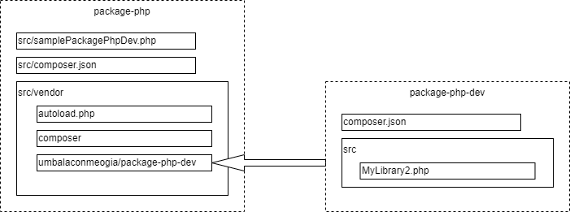

# Giải thích cách tạo PHP package.

## Overview

Tài liệu này giải thích về tác dụng của chương trình quản lý PHP package *composer*, ý nghĩa của file composer.json, và cách để đóng gói một package của mình.

Nói ngắn gọn, thì để đóng gói các file PHP thành một package mà ta có thể sử dụng nó trong các chương trình khác thông qua lệnh composer, ta chỉ cần tạo cho nó một file composer.json.

Trong tài liệu này, ta sẽ tìm hiểu kiến thức theo thứ tự sau
* Lệnh require của PHP
* Trình quản lý thư viện composer
* Cách tạo một package
* Quy trình để phát triển một package.
* Tìm hiểu kỹ hơn về composer

### Một vài quy ước

* Các chương trình ví dụ giới thiệu trong tài liệu này được public ở trên github.com, bao gồm 2 repositories.
    
    * https://github.com/umbalaconmeogia/package-php-dev là mã nguồn của một PHP package.
    * https://github.com/umbalaconmeogia/package-php là các chương trình ví dụ để thực thi, và nó có sử dụng package umbalaconmeogia/package-php-dev
* Việc chạy các chương trình thực thi (như `composer install`, `php sampleRequire.php`, `php samplePackagePhpDev.php`) được thực hiện khi đang ở trong thư mục *src*.

### Từ vựng trong tài liệu

|Từ vựng|Giải thích|
|---|---|
|Chương trình thực thi|Là file PHP mà ta sẽ gọi thực thi bằng lệnh php để chạy chương trình và cho ra kết quả gì đó. Trong tài liệu này, các chương trình thực thi được để trong thư mục [src](src) của Github repository [umbalaconmeogia/package-php](https://github.com/umbalaconmeogia/package-php)|
|Composer| Composer có 2 ý nghĩa.<br />1. Chương trình Composer chạy trên máy tính, dùng để quản lý các package dựa theo thông tin khai báo trong file composer.json<br />2. Một PHP package nằm trong thư mục *vendor/composer* để giúp chương trình thực thi của ta tìm ra được các PHP class cần sử dụng.|
|Namespace|Là cách PHP dùng để chỉ định một class. Ta có thể dễ dàng tìm được file chứa mã nguồn của một class từ namespace của nó theo quy tắc đường dẫn PSR-4.|
|Package|Một nhóm các chương trình PHP được gom lại để có thể được tái sử dụng trong nhiều chương trình khác. Trong tài liệu này, ta sử dụng một package là [umbalaconmeogia/package-php-dev](https://github.com/umbalaconmeogia/package-php-dev)|
|PSR|Quy chuẩn PHP = PHP Standards Recommendations|

## Lệnh require của PHP

Lệnh [require](https://www.php.net/manual/en/function.require.php) (cũng như lệnh [include](https://www.php.net/manual/en/function.include.php)) của PHP cho phép ta chèn các phần code trong một file PHP khác vào đoạn code ta đang viết.

Như vậy thay vì ta phải viết một file PHP thật dài, thì có thể chia các dòng code vào các file khác nhau (để dễ quản lý) và dùng lệnh *require* để chèn các đoạn code PHP trong file đó vào chỗ ta muốn.

Giả sử ta có một file *lib/MyLibrary.php* có dòng code của function helloWorld() như sau

```php
<?php
function helloWorld()
{
    echo "Hello World\n";
}
```

Giờ ta có file chương trình thực thi [sampleRequire.php](src/sampleRequire.php) trong đó ta chèn code của file *lib/MyLibrary.php* vào như sau

```php
<?php
require "lib/MyLibrary.php";

helloWorld();
```

Khi chạy chương trình *sampleRequire.php*, ta sẽ được kết quả của việc gọi function helloWorld().
```shell
php sampleRequire.php
```
cho kết quả
```shell
Hello World
```

*Giải thích*: Require file *lib/MyLibrary.php* trong *sampleRequire.php* ở trên cũng tương đương với viết trực tiếp code của file *MyLibrary.php* vào trong file *sampleRequire.php* như sau (không dùng đến lệnh require nữa).
```php
<?php
function helloWorld()
{
    echo "Hello World\n";
}

helloWorld();
```


## Trình quản lý thư viện composer

Bằng việc chia các dòng code PHP vào các file như ở trên, ta sẽ có thể sử dụng những dòng code này khi cần đến, bằng cách *require* các file đó khi cần thiết.
Điều này cho phép ta dễ xây dựng và sử dụng được những chương trình/thư viện PHP lớn, phức tạp.

Tập hợp của những file PHP này được gom lại thành các package để dễ quản lý và sử dụng.

Nhiều package được công khai (public) trên mạng internet, để mọi người có thể lấy về sử dụng.

Ta có thể download các package (là một tập hợp các file PHP) về, và dùng lệnh require để chèn nó vào trong chương trình PHP của ta, và có thể sử dụng tính năng được người khác viết ra trong các package đó.

Để việc sử dụng được dễ dàng, thì các package cần được xây dựng theo những *quy chuẩn* nhất định, để chúng có tính thống nhất về cấu trúc.

Ngoài ra, bản thân các package A nào đó cũng lại sử dụng đến các package B khác nữa, ta gọi là package A phụ thuộc package B. Đến lượt package B lại có thể phụ thuộc vào các package khác nữa.

Để sử dụng package A, thì ngoài việc download code của package A về, ta còn cần phải download cả code của package B, và code của cả các package mà B phụ thuộc vào nữa...


Chúng có thể là một mối quan hệ vô cùng rối rắm, mà nếu làm việc này một cách thủ công thì sẽ rất phiền. Nên người ta dùng một chương trình để giúp tự động hóa việc đó, gọi là chương trình quản lý phụ thuộc (dependency management).

[Composer](https://getcomposer.org/) là một chương trình quản lý phụ thuộc như vậy. Khi ta cần một package A, bên cạnh việc download A về, nó sẽ tìm những package mà A phụ thuộc và download chúng.

Để làm được điều đó, Composer dựa vào file *composer.json* để biết ta cần các package nào, và package đó có thể được download về từ đâu. Nó sẽ lần theo các thông tin đó để tự động lôi các package cần thiết về cho ta.

Các package đó sẽ được để trong một thư mục tên là *vendor*, và nó còn tạo ra một file *vendor/autoload.php* trong đó require toàn bộ các package đã được download về đó.
Và chương trình của ta chỉ cần require cái file *vendor/autoload.php* đó là có thể sử dụng những package ta đã download về.

### Khai báo phụ thuộc trong composer.json

Ta tạo một file [composer.json](src/composer.json) như sau trong mã nguồn chương trình thực thi (đây là file composer.json để download các thư viện ta muốn sử dụng, không phải là file composer.json của package).

```json
{
    "minimum-stability": "dev",
    "require": {
        "umbalaconmeogia/package-php-dev": "*"
    },
    "repositories": [
        {
            "type": "vcs",
            "url":  "git@github.com:umbalaconmeogia/package-php-dev.git"
        }
    ]
}
```

Chỉ dẫn *require* trong file *composer.json* này báo rằng ta cần sử dụng package tên là *umbalaconmeogia/package-php-dev*, và chỉ dẫn *repositories* cho biết ta có thể tìm nó ở trên github, tại địa chỉ https://github.com/umbalaconmeogia/package-php-dev

Khi chạy lệnh
```shell
composer install
```
nó sẽ tạo ra thư mục *vendor*, download code của các package cần thiết, và tạo ra file *vendor/autoload.php* để require code của package đã download về.
Nó cũng tạo ra file *composer.lock* nữa, nhưng ta sẽ không đề cập tới ở đây.

Giờ ta tạo một chương trình PHP [samplePackagePhpDev.php](src/samplePackagePhpDev.php) để sử dụng package *umbalaconmeogia/package-php-dev* đã download về ở trên như sau
```php
<?php
require "vendor/autoload.php";

\umbalaconmeogia\packagephpdev\MyLibrary2::goodBye();
```

Khi chạy chương trình thực thi *samplePackagePhpDev.php*, ta sẽ được kết quả của việc gọi function [MyLibrary2::goodBye()](https://github.com/umbalaconmeogia/package-php-dev/blob/main/src/MyLibrary2.php#L6).
```shell
php samplePackagePhpDev.php
```
cho kết quả
```shell
Good bye
```

## Cách tạo package

Nói ngắn gọn, thì để tạo ra một package PHP, thì ta tạo cho nó một file composer.json và định nghĩa các thông tin cần thiết về package trong đó.

Package *umbalaconmeogia/package-php-dev* có một file [composer.json](https://github.com/umbalaconmeogia/package-php-dev/blob/main/composer.json) của nó.

File này có nội dung như sau
```json
{
    "name": "umbalaconmeogia/package-php-dev",
    "autoload": {
        "psr-4": {"umbalaconmeogia\\packagephpdev\\": "src/"}
    }
}
```
Nó định nghĩa tên của package này là *umbalaconmeogia/package-php-dev*,
và các file đặt trong thư mục *src* sẽ có *namespace* bắt đầu bằng *umbalaconmeogia\packagephpdev*.
Do đó, file MyLibrary2.php đặt trong thư mục *src* sẽ có namespace là "umbalaconmeogia\packagephpdev\MyLibrary2".

Composer sẽ dễ dàng tìm được các file class theo thông tin trong file composer.json do chúng ta tuân theo quy chuẩn của PHP (PSR = PHP Standards Recommendations) khi viết mã nguồn PHP.

Đến đây, ta đã biết được file *composer.json* định nghĩa các thông tin sau:
1. Tên và namespace của một package (để các chương trình khác có thể sử dụng nó, thông qua các đoạn chương trình PHP của composer - có một thư mục *vendor/composer* chứa các chương trình PHP để giúp kết nối các package được download về thông qua Composer, và file *vendor/autoload.php* mà ta đã biết, thực ra là nó lại require các file PHP nằm trong thư mục *vendor/composer* này).
2. Các thư viện mà ta cần sử dụng cũng như nơi để download nó về (thông qua các chỉ dẫn *require* và *repositories*).

Chú ý rằng ý thứ 2 (các thư viện mà ta cần sử dụng cũng như nơi để download nó về) có thể diễn giải là các thư viện mà chương trình của ta muốn sử dụng (trong phần "Khai báo phụ thuộc trong composer.json" ở trên), và cũng có thể hiểu là các thư viện mà bản thân cái thư viện ta đang phát triển (umbalaconmeogia/package-php-dev) muốn sử dụng code của nó. Vẫn là cùng một ý nghĩa.

Đến đây, ta đã có được kiến thức tối thiểu để có thể đóng gói code PHP của ta thành một thư viện (bằng việc tạo ra một file composer.json cho nó), và sử dụng thư viện đó trong các chương trình/thư viện khác (thông qua việc require nó trong file composer.json của chương trình đó, rồi dùng lệnh composer để download nó về).

## Quản lý version của package

Trong file [composer.json](src/composer.json) có hai chỉ dẫn quan trọng
* Chỉ dẫn *require* cho biết các package ta cần sử dụng (và version của nó) để chương trình Composer tìm download package đó về, đặt trong thư mục *vendor* và upload thông tin vào trong *vendor/composer* để sau này chương trình thực thi có thể tìm ra mã nguồn cần thiết.
    Ví dụ dưới đây báo rằng ta cần sử dụng package umbalaconmeogia/package-php-dev với version mới nhất có thể sủ dụng.
    ```json
    "require": {
        "umbalaconmeogia/package-php-dev": "*"
    },
    ```
* Chỉ dẫn *repositories* khai báo nơi ta có thể đi tìm mã nguồn của package.

Composer có 2 nơi để tìm ra mã nguồn của package để download về.
* Đầu tiên, nó sẽ tìm trong các thông tin khai báo trong chỉ dẫn *repositories*. Nếu tìm thấy trong các đường dẫn được khai báo trong này thì nó sẽ download từ đây.
* Nếu không có trong *repositories*, thì nó sẽ tìm ở trên kho [Packagist](https://packagist.org/). Đây là nơi mà các PHP package thường khai báo vị trí repository của nó (đặt trên Github, Gitlab, Bitbucket, hay bất kỳ nơi nào).
* Nếu không tìm được ra nơi đặt package hoặc không có version phù hợp với yêu cầu thì nó sẽ báo lỗi.

Trong chỉ dẫn *repository*, ta lại chỉ định nơi đặt mã nguồn package theo nhiều kiểu khác nhau.
* Nơi đặt ngay trên cùng máy tính đang chạy chương trình thực thi (sẽ có `"type": "path"`).
    Ví dụ dưới đây chỉ định đường dẫn tới thư mục *../../package-php-dev* (là thư mục nằm ở cấp ngoài chương trình thực thi). Vì ta để `"symlink": true` cho nên nó sẽ không copy source code của package vào trong vendor, mà chỉ tạo ra một symbolic link; việc sủa đổi source code của package sẽ ngay lập tức được phản ảnh trên chương trình thực thi.
    ```json
    "repositories": [
        {
            "type": "path",
            "url": "../../package-php-dev",
            "symlink": true
        }
    ]
    ```
* Nơi đặt ở trên một Git repository (hoặc Subversion/Mecurial/Fossil) trên internet.
    Ví dụ
    ```json
    "repositories": [
        {
            "type": "vcs",
            "url":  "git@github.com:umbalaconmeogia/package-php-dev.git"
        }
    ]
    ```

Các version của chương trình lưu trên Git repository được đánh dấu bằng các tag ta gán cho một phiên bản trong repository đó.
Thông thường, nếu ta không chỉ định version (để là "*") thì Composer sẽ tự động tìm và download version mới nhất trong các version thích hợp của một package.

Mỗi phiên bản của source code sẽ có thể có nhiều yêu cầu cụ thể về version của các package phụ thuộc, hay version của OS, version của PHP... được khái báo trong file *composer.json* của phiên bản đó. Chương trình Composer sẽ tính toán các yếu tố này để tìm ra các phiên bản thích hợp nhất cho mỗi package cần download về. Nếu không thể tìm được thì nó sẽ báo lỗi.

## Quy trình phát triển một package

Một package thường là một tập hợp của nhiều file, nhiều class viết bằng ngôn ngữ PHP, và chúng sẽ được gọi ra từ các chương trình thực thi, chứ chúng ta không chạy trực tiếp từ thư mục source code của package. Lí do là vì package có thể còn cần sử dụng tới các package, các file khác nằm trong source code của chương trình thực thi.

Vì vậy để phát triển một package, ta sẽ có 2 thư mục riêng biệt.
1. Một là thư mục chỉ chứa riêng source code của package đang phát triển.
2. Một là thư mục của chương trình thực thi. Nó có thể là các file PHP đơn giản, hoặc là một chương trình dựa trên framework Laravel, Yii...

Quy trình phát triển một package có thể theo 3 bước sau.

1. Trong quá trình phát triển package, đầu tiên ta sẽ chỉ dẫn trong *repositories* của chương trình thực thi để nó tìm ra package ở trên Local PC.
    Khi đó file *composer.json* của chương trình thực thi sẽ khai báo kiểu như sau:
    ```json
    {
        "minimum-stability": "dev",
        "require": {
            /* các khai báo khác */
            "umbalaconmeogia/package-php-dev": "*"
        },
        "repositories": [
            /* các khai báo khác */
            {
                "type": "path",
                "url": "../../package-php-dev",
                "symlink": true
            }
        ]
    }
    ```
2. Sau khi quá trình phát triển và test package hoàn tất, ta đẩy nó lên trên Git repository trên internet (có thể là một public hoặc private repository).
    Ta sửa lại file *composer.json* của chương trình thực thi để tìm package ở trên online repository.
    Khi đó file *composer.json* của chương trình thực thi sẽ khai báo kiểu như sau:
    ```json
    {
        "minimum-stability": "dev",
        "require": {
            "umbalaconmeogia/package-php-dev": "*"
        },
        "repositories": [
            {
                "type": "vcs",
                "url":  "git@github.com:umbalaconmeogia/package-php-dev.git"
            }
        ]
    }
    ```
3. Nếu ta muốn public package "xịn xò" của mình để người khác có thể sử dụng nó dễ dàng mà không cần phải biết nó đang được đặt ở đâu, thì đăng ký thông tin của nó vào [Packagist](https://packagist.org/). Cách làm việc với Packagist nằm ngoài phạm vi của tài liệu này.

## Hiểu sâu hơn về composer

Trong phần trên, nội dung của file composer.json được để ở mức tối thiểu. Giờ ta sẽ tìm hiểu sâu hơn về chương trình Composer.

### Các lệnh của composer
TBD

### File composer.json
TBD
